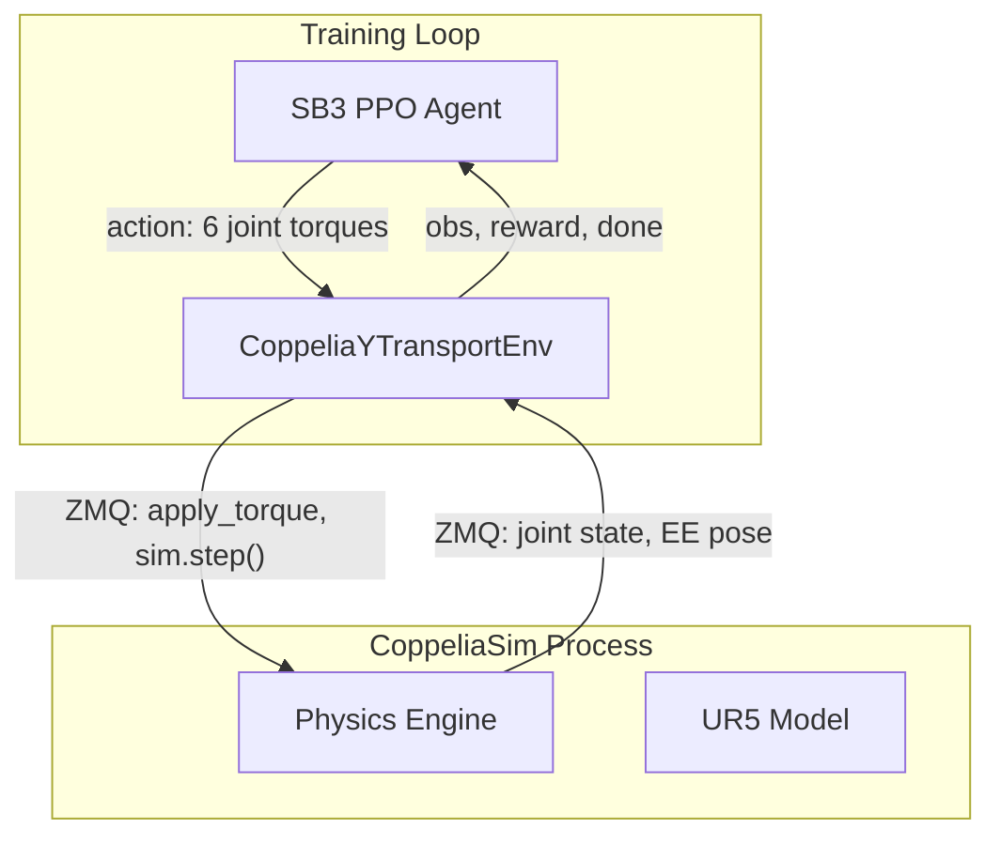

# RL Y-Axis Transport Controller (CoppeliaSim UR5)

Direct-torque Y-axis end-effector transport learned with **PPO** (Stable-Baselines3) in CoppeliaSim on WSL. This path replaces further model-based gain tuning after Cartesian Z PID and gravity compensation proved insufficient for stable long sweeps.

## Architecture



| Component | Path |
|-----------|------|
| Gymnasium env | `rl/coppelia_y_transport_env.py` |
| PPO trainer | `rl/train_ppo.py` |
| Policy evaluator | `rl/eval_policy.py` |
| Hyperparameters | `rl/config.yaml` |
| Training launcher | `simulation/launch_rl_training_wsl.sh` |
| Env smoke test | `simulation/run_rl_smoke_test.sh` |

The env wraps `ros2_ws/src/ur5_x_axis_controller_ros/ur5_x_axis_controller_ros/coppeliasim_adapter.py` for ZMQ torque control, EE pose reads, and task-frame handling (`mujoco_attachment_dummy`).

## Dependencies (WSL)

```bash
python3 -m pip install stable-baselines3 gymnasium tensorboard
```

Optional for progress bar: `pip install tqdm rich`

CoppeliaSim ZMQ client must be on `PYTHONPATH` via `simulation/env_wsl_local.sh` (`COPPELIA_PYDEPS`).

## CoppeliaSim launch notes (WSL)

**Do not use `-h` with `dfltscn.ttt` on this build** — CoppeliaSim starts the ZMQ server then exits immediately. The working pattern matches `simulation/run_torque_y_transport_wsl.sh`:

1. Start CoppeliaSim **without** `-h` and **without** a scene argument.
2. Wait for port `23000` and confirm the process is still alive (`kill -0 $SIM_PID`).
3. Let Python load `UR5.ttm` over ZMQ on first env connect/reset.

```bash
cd "${COPPELIA_ROOT}"
./coppeliaSim.sh \
  -GzmqRemoteApi.rpcPort=23000 \
  -GzmqRemoteApi.cntPort=23001 \
  >outputs/control_runs/rl_coppelia_sim.log 2>&1 &
```

Remove `addOns/ur5_video_smoke_addon.lua` and set `REAL_CARTPOLE_ENABLE_VIDEO_SMOKE=0` so smoke add-ons do not stop the simulator.

## Quick start

### 1. Smoke test (connect, reset, 5 random steps)

```bash
cd /mnt/c/Users/sandr/Downloads/real-cartpole-control-using-ur5-direct-torque
bash simulation/run_rl_smoke_test.sh
```

Expected: `Smoke test passed!` with `obs shape=(28,)`.

### 2. Train PPO

```bash
bash simulation/launch_rl_training_wsl.sh
# shorter first run:
TIMESTEPS=500000 bash simulation/launch_rl_training_wsl.sh
# resume:
bash simulation/launch_rl_training_wsl.sh --resume outputs/rl_models/ppo_y_transport
```

Outputs:

| Artifact | Path |
|----------|------|
| TensorBoard logs | `outputs/rl_logs/PPO_*` |
| Checkpoints | `outputs/rl_models/checkpoints/` |
| Final model | `outputs/rl_models/ppo_y_transport.zip` |
| CoppeliaSim log | `outputs/control_runs/rl_coppelia_sim.log` |

TensorBoard:

```bash
python3 -m tensorboard.main --logdir outputs/rl_logs
```

### 3. Evaluate trained policy

Start CoppeliaSim (or use the training launcher pattern), then:

```bash
PYTHONPATH="${REPO_ROOT}:${COPPELIA_PYDEPS}" \
  python3 rl/eval_policy.py \
    --model outputs/rl_models/ppo_y_transport \
    --port 23000 \
    --coppelia-root "${COPPELIA_ROOT}" \
    --episodes 5
```

Summary JSON: `outputs/rl_eval/eval_summary.json`

## Baseline warm-start (model-based controller)

The model-based path already has a working **hold PD + MuJoCo gravity** stack (`kp=300`, `kd=40`, `gravity_scale=1.0`). The RL env reuses it as a **residual baseline**:

```
tau_applied = tau_baseline + residual_scale * (action * tau_max)
```

| Mode | Behavior |
|------|----------|
| `baseline.mode: residual` | Hold + gravity every step; RL learns corrections (default) |
| `baseline.mode: off` | Raw torques from policy only (original behavior) |

On each `reset()`, the baseline runs for `reset_warmup_steps` (default 20) before the first observation so episodes start from a settled pose instead of collapsing at step 1.

Config (`rl/config.yaml` → `baseline:`):

- `hold_kp`, `hold_kd`, `gravity_scale` — same semantics as `run_torque_y_transport_wsl.sh`
- `residual_scale: 0.25` — RL torque is a ±25% perturbation on top of baseline
- `enable_cart_z` / `enable_y_tracking` — optional Cartesian feedback via `J^T` (off by default; numerical Jacobian is slow)

Code: `rl/baseline_controller.py`, `rl/gravity_utils.py`

**Future options** (not implemented yet):

- Behavioral cloning: log `(obs, tau_baseline)` from `run_torque_y_transport_wsl.sh` and pre-train the policy
- Decay `residual_scale` curriculum: start at 0.1, increase as reward improves

## Control design

| Parameter | Value |
|-----------|-------|
| Physics `sim_dt` | 5 ms (200 Hz) |
| Action repeat | 4 → 50 Hz policy |
| Episode length | 400 steps (~8 s sim time) |
| Target Y displacement | 0.04 m (world −Y) |
| Torque limits (Nm) | `[30, 150, 150, 28, 28, 28]` |

### Observation (28-dim)

| Block | Dims | Notes |
|-------|------|-------|
| sin(q), cos(q) | 12 | Avoids joint wrap discontinuities |
| qd normalized | 6 | ÷ 3 rad/s |
| EE position error | 3 | target − current (X hold, Y track, Z hold) |
| Orientation error | 3 | `orientation_error_vec_wxyz` |
| EE linear velocity | 3 | m/s |
| Target Y velocity | 1 | reference speed |

### Action (6-dim)

Normalized torques in `[-1, 1]`, scaled per joint to `tau_max`.

### Reward

```
r = 2.0 * y_vel_toward_target
  - 10.0 * |z_err|
  - 5.0 * |x_err|
  - 5.0 * |ori_err|
  - 0.001 * ||action - prev_action||²
  + 0.5   # alive bonus
```

Terminal (`done=True`, + `terminal_penalty=-10`):

- |z_err| > 0.10 m
- |x_err| > 0.10 m
- |ori_err| > 0.5 rad
- any |qd| > 3.0 rad/s

## PPO hyperparameters (`rl/config.yaml`)

| Key | Default |
|-----|---------|
| `learning_rate` | 3e-4 |
| `n_steps` | 2048 |
| `batch_size` | 64 |
| `n_epochs` | 10 |
| `gamma` | 0.99 |
| `gae_lambda` | 0.95 |
| `clip_range` | 0.2 |
| `net_arch` | [256, 256] |
| `total_timesteps` | 1_000_000 |

## Training considerations

- **Single env:** CoppeliaSim ZMQ is single-threaded; one simulator instance per training process.
- **Slow steps:** Each policy step = 4 physics steps over RPC; 500k–1M timesteps can take tens of minutes to hours on WSL.
- **Early episodes:** Random actions often terminate quickly (Z drift); reward is dominated by `terminal_penalty` until the policy learns to hold pose.
- **Curriculum (future):** Reduce `target_dy_m` in `rl/config.yaml` for easier early training, then increase.
- **Domain randomization:** `init_noise_std_rad: 0.02` on seed joint pose at reset.

## Relation to model-based controller

The model-based Y-transport path (`simulation/run_torque_y_transport_wsl.sh`, IK joint PD + MuJoCo gravity bias) remains for comparison. RL does **not** use explicit gravity feedforward; the policy must learn compensation from state. See `docs/coppeliasim/TORQUE_DIAGNOSTICS.md` for gravity calibration history that motivated the RL pivot.

## Failure signatures

| Symptom | Likely cause |
|---------|----------------|
| `Cannot connect to CoppeliaSim` | Port not open, or sim exited (check `rl_coppelia_sim.log` for `simZMQ: cleanup`) |
| ZMQ connect hangs forever | Used `-h` flag; sim died after loading add-ons |
| `ImportError: tqdm and rich` | Harmless if `progress_bar=False`; install extras or ignore |
| Episodes end at step 1 with random policy | Expected; untrained torques violate Z/X/ori limits |
